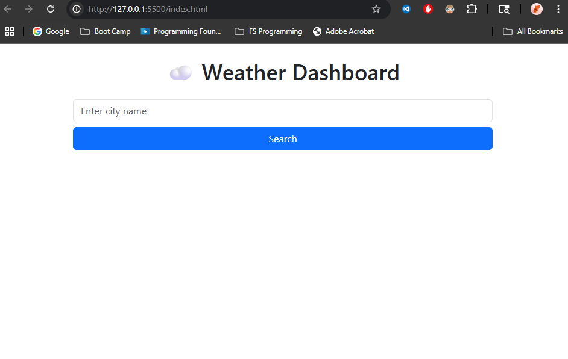
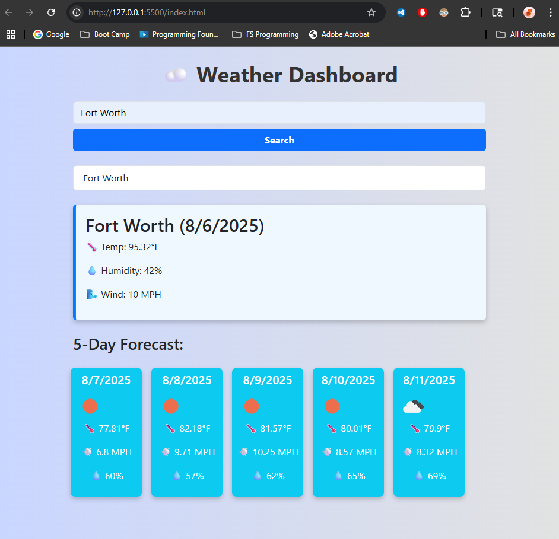

# ☁️ Weather Dashboard

A responsive weather dashboard that allows users to search for a city and view both the current weather and a 5-day forecast. The application also stores search history using localStorage, making it easy to revisit previous searches.

Live Demo: ---

---

## 🔍 Features

- Search for weather by **city name**
- Display of **current temperature, wind speed, and humidity**
- **5-Day Forecast** with weather icons
- **Search history** that persists via `localStorage`
- **DayJS** used for date formatting
- Responsive layout with **Bootstrap 5**

---

## 🖼️ Screenshots

### 💡 Full Dashboard


### 🔍 5-Day Forecast Example


> Replace the `assets/images/` paths with your actual image paths.  
> Or if you uploaded them via GitHub drag-and-drop, use the URLs GitHub gives you.

---

## 🛠️ Technologies Used

- HTML5
- CSS3 (Custom + Bootstrap 5)
- JavaScript (ES6+)
- OpenWeatherMap API
- Day.js
- Git / GitHub

---

## 📁 Project Structure

---

## 🚀 Installation & Usage

1. Clone the repo:
   ```bash
   git clone https://github.com/your-username/weather-dashboard.git
2. Open index.html in a browser
3. Replace API in script.js with your own from OpenWeather
